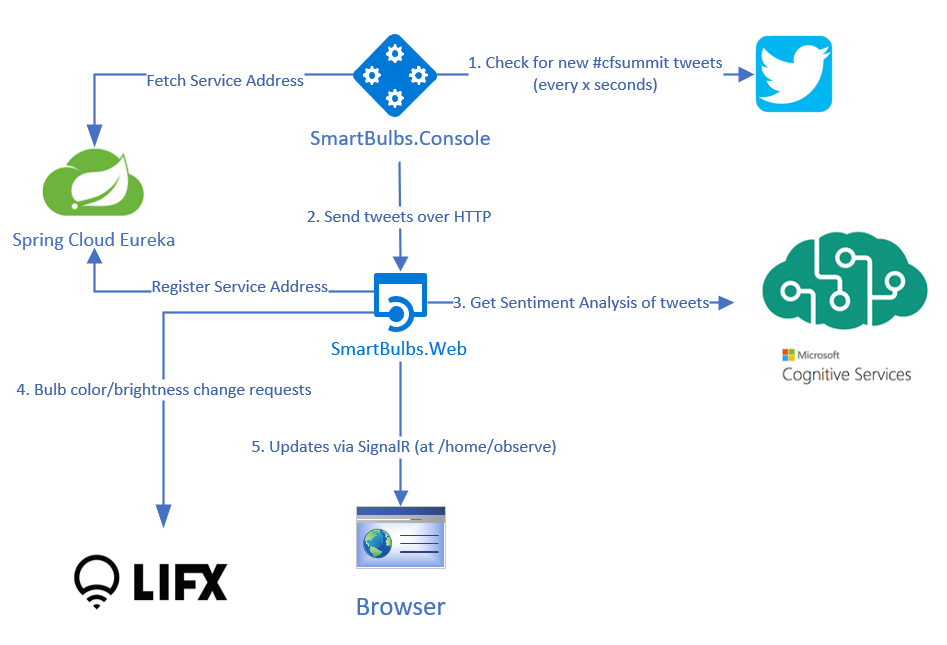

# PCF Smart Bulb Demo

## Overview

This repository consists of two .NET Core applications and one .NET Standard library. All code is C#. One of the applications is ASP.NET MVC (SmartBulbs.Web) and the other is a .NET Core Console application (SmartBulbs.Console). SmartBulbs.Common is for sharing models between the two applications.

## Tools used

- ASP.NET Core (2.1)
  - SmartBulbs.Web: provides a UI for getting a CredHub password, reading tweets on demand, and viewing sentiment analysis and color results
    - MVC: for views and HTTP endpoints
    - SignalR: powers the Observation deck
- .NET Core Console application
  - SmartBulbs.Console:
    - polls twitter for new #cfsummit tweets
    - uses Eureka to find SmartBulbs.Web and share tweets via HTTP

### Software Libraries

- [LifxIoT](https://www.nuget.org/packages/LifxIoT/) - for calling the LIFX API to update the bulbs
- [LinqToTwitter](https://www.nuget.org/packages/linqtotwitter/5.0.0-beta2) - for reading tweets
- [Zxcvbn-core](https://www.nuget.org/packages/zxcvbn-core/) - .NET Port of Dan Wheeler/Dropbox's JavaScript library - for analyzing password strength
- [Steeltoe](https://steeltoe.io)
  - Service Discovery - for the SmartBulbs.Console to discover SmartBulbs.Web
  - CloudFoundry Configuration - to read Cloud Foundry environment variables
  - CredHub Client - for interactions with CredHub
  - Management - for application management and monitoring

### 3rd Party Services

- Microsoft Cognitive Services Text Analysis API
  - [Sentiment Analysis](https://azure.microsoft.com/en-us/services/cognitive-services/text-analytics/) - determines how the writer is feeling based on the words in their message
- [LIFX](https://www.lifx.com/) HTTP API - controls the smart bulbs
- [Twitter](https://twitter.com)

## Twitter monitoring overview

